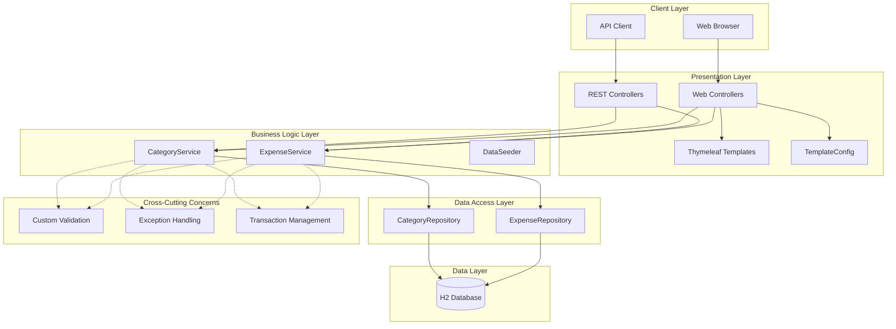
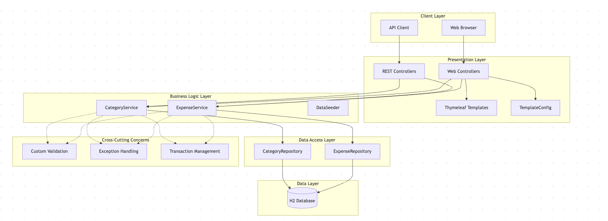
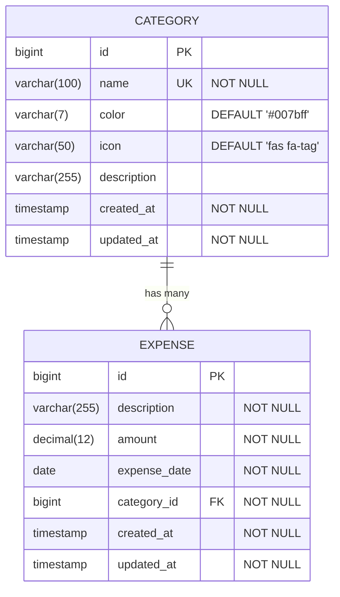
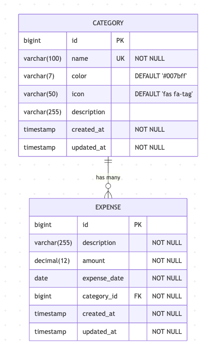
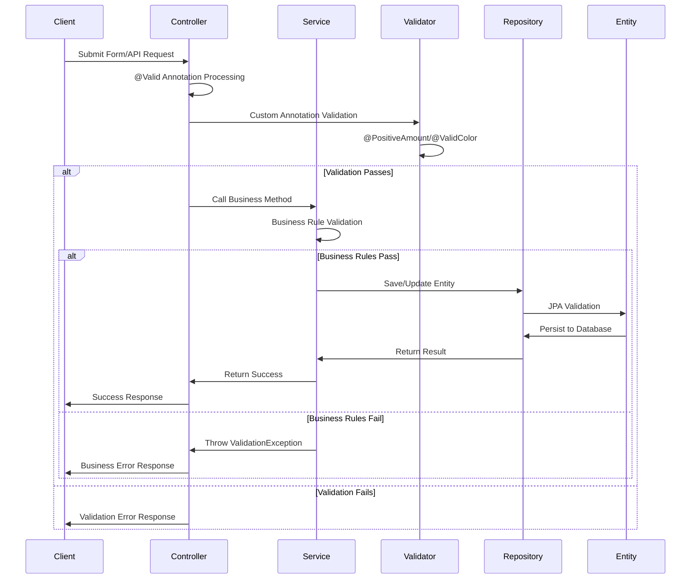
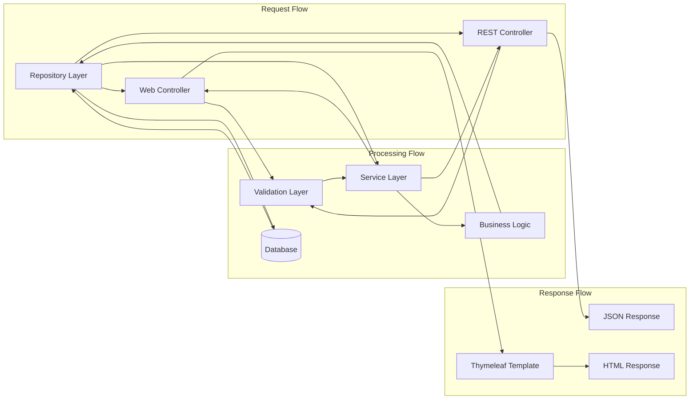
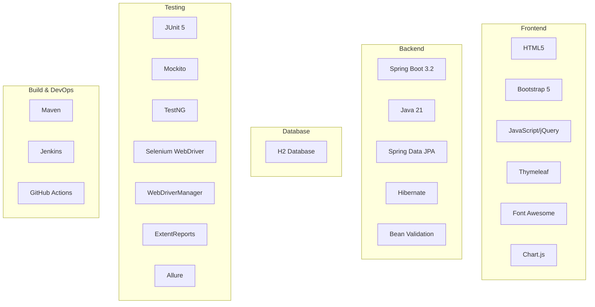
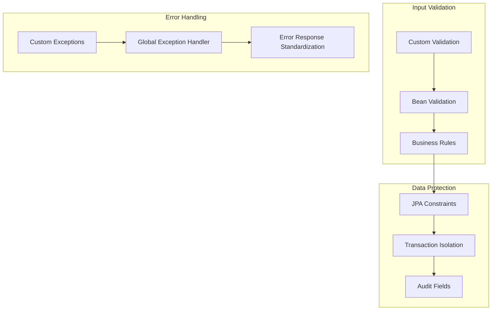
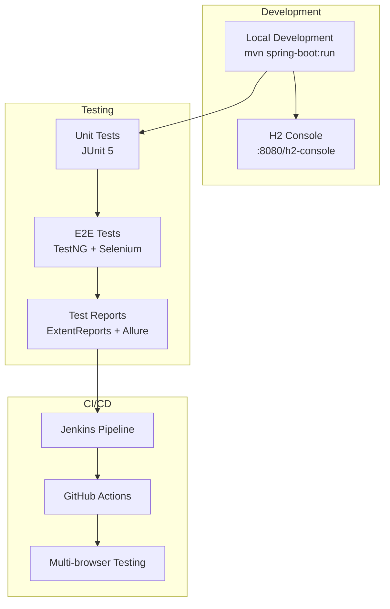

# Personal Expense Tracker - Architecture Documentation

## System Overview

The Personal Expense Tracker is a full-stack Spring Boot application that follows a layered architecture pattern with comprehensive validation, dual-interface design, and enterprise-grade testing.

## High-Level Architecture



## Network Relationship Diagram (NRD)



## Detailed Component Architecture

```mermaid
graph TB
    subgraph "Controller Layer"
        subgraph "Web Controllers"
            HC[HomeController]
            EC[ExpenseController]
            CC[CategoryController]
        end
        
        subgraph "REST Controllers"
            ERC[ExpenseRestController]
            CRC[CategoryRestController]
            DRC[DashboardRestController]
        end
    end
    
    subgraph "Service Layer"
        ES[ExpenseService<br/>@Transactional]
        CS[CategoryService<br/>@Transactional]
    end
    
    subgraph "Repository Layer"
        ER[ExpenseRepository<br/>extends JpaRepository]
        CR[CategoryRepository<br/>extends JpaRepository]
    end
    
    subgraph "Entity Layer"
        EE[Expense Entity<br/>@PositiveAmount<br/>@ValidColor]
        CE[Category Entity<br/>@ValidColor]
    end
    
    subgraph "Validation Layer"
        PA[@PositiveAmount]
        VC[@ValidColor]
        PAV[PositiveAmountValidator]
        VCV[ValidColorValidator]
    end
    
    subgraph "Exception Layer"
        VE[ValidationException]
        ENE[EntityNotFoundException]
    end
    
    HC --> ES
    HC --> CS
    EC --> ES
    EC --> CS
    CC --> CS
    ERC --> ES
    CRC --> CS
    DRC --> ES
    DRC --> CS
    
    ES --> ER
    CS --> CR
    ER --> EE
    CR --> CE
    
    EE --> PA
    EE --> VC
    CE --> VC
    PA --> PAV
    VC --> VCV
    
    ES --> VE
    ES --> ENE
    CS --> VE
    CS --> ENE
```

## Entity Relationship Diagram




## Template Architecture (Dual-Layout System)

```mermaid
graph TB
    subgraph "Template Configuration"
        TC[TemplateConfig]
        AP[application.properties<br/>app.template.use-new-layout]
    end
    
    subgraph "Template Selection Logic"
        TS[getTemplateSuffix()]
        CL[Classic Layout: -classic]
        NL[New Layout: -new]
    end
    
    subgraph "Template Files"
        subgraph "Expenses"
            ELC[expenses/list-classic.html]
            ELN[expenses/list-new.html]
            EFC[expenses/form-classic.html]
            EFN[expenses/form-new.html]
        end
        
        subgraph "Categories"
            CLC[categories/list-classic.html]
            CLN[categories/list-new.html]
            CFC[categories/form-classic.html]
            CFN[categories/form-new.html]
        end
        
        subgraph "Dashboard"
            HDC[home/dashboard-classic.html]
            HDN[home/dashboard-new.html]
        end
    end
    
    AP --> TC
    TC --> TS
    TS --> CL
    TS --> NL
    CL --> ELC
    CL --> EFC
    CL --> CLC
    CL --> CFC
    CL --> HDC
    NL --> ELN
    NL --> EFN
    NL --> CLN
    NL --> CFN
    NL --> HDN
```

## Testing Architecture

```mermaid
graph TB
    subgraph "Unit Testing (JUnit 5)"
        ST[Service Tests<br/>@ExtendWith(MockitoExtension)]
        RT[Repository Tests<br/>@DataJpaTest]
        CT[Controller Tests<br/>@WebMvcTest]
    end
    
    subgraph "Integration Testing"
        IT[Integration Tests<br/>@SpringBootTest]
        TC[TestConfig]
    end
    
    subgraph "E2E Testing (TestNG)"
        subgraph "Page Object Model"
            BP[BasePage]
            HP[HomePage]
            EP[ExpensesPage]
            CP[CategoriesPage]
            EFP[ExpenseFormPage]
            CFP[CategoryFormPage]
        end
        
        subgraph "Test Infrastructure"
            BT[BaseTest]
            WDC[WebDriverConfig]
            SU[ScreenshotUtils]
            AU[AssertUtils]
            WU[WaitUtils]
        end
        
        subgraph "Test Execution"
            TNGConf[testng.xml]
            ERep[ExtentReports]
            Allure[Allure Reports]
        end
    end
    
    subgraph "Test Data"
        EB[ExpenseBuilder]
        CB[CategoryBuilder]
        MDH[MockDataHelper]
    end
    
    ST --> EB
    ST --> CB
    RT --> MDH
    BP --> HP
    BP --> EP
    BP --> CP
    HP --> EFP
    EP --> EFP
    CP --> CFP
    BT --> WDC
    BT --> SU
    BP --> AU
    BP --> WU
    TNGConf --> ERep
    TNGConf --> Allure
```

## Validation Flow



## Data Flow Architecture



## Technology Stack



## Key Architectural Decisions

### 1. Dual-Layout Template System

- **Decision**: Implement configurable template system with `-classic` and `-new` suffixes
- **Rationale**: Allows safe UI migration without breaking existing functionality
- **Implementation**: `TemplateConfig` component with `getTemplateSuffix()` method

### 2. Custom Validation Framework

- **Decision**: Create domain-specific validation annotations (`@PositiveAmount`, `@ValidColor`)
- **Rationale**: Encapsulate business rules in reusable, declarative annotations
- **Implementation**: Custom validator classes implementing `ConstraintValidator`

### 3. Multi-Framework Testing Strategy

- **Decision**: Use JUnit 5 for unit tests, TestNG for E2E tests
- **Rationale**: Leverage JUnit's simplicity for unit tests, TestNG's advanced features for E2E
- **Implementation**: Separate test configurations and parallel execution strategies

### 4. Separation of Web and REST Controllers

- **Decision**: Maintain separate controller classes for web and API endpoints
- **Rationale**: Clear separation of concerns, different response formats
- **Implementation**: Web controllers return template names, REST controllers return `ResponseEntity`

### 5. Transaction Management Strategy

- **Decision**: Use `@Transactional` at service layer with read-only optimization
- **Rationale**: Ensure data consistency while optimizing read operations
- **Implementation**: `@Transactional(readOnly = true)` for query methods

## Security Considerations



## Performance Considerations

- **Lazy Loading**: JPA entities use `FetchType.LAZY` for associations
- **Connection Pooling**: H2 database with built-in connection management
- **Transaction Optimization**: Read-only transactions for query operations
- **Caching**: Template caching disabled in development mode
- **Parallel Testing**: TestNG configured for parallel test execution

## Deployment Architecture



This architecture documentation provides a comprehensive view of the Personal Expense Tracker system, highlighting its key architectural patterns, component relationships, and design decisions that make it a robust, maintainable, and testable application.
