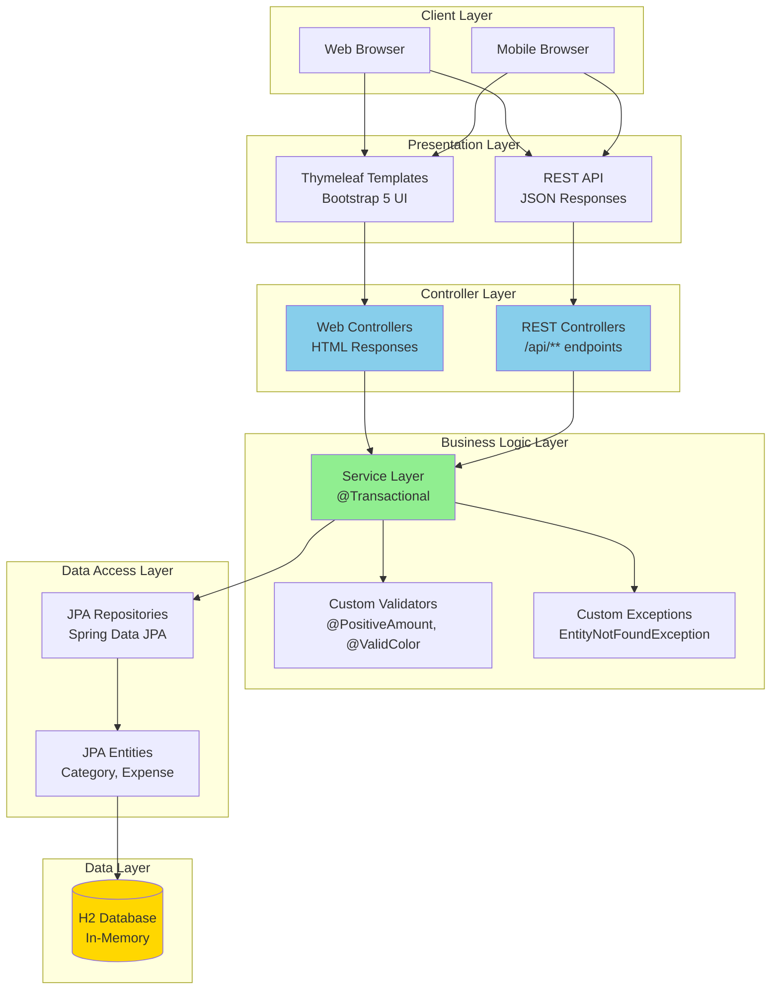
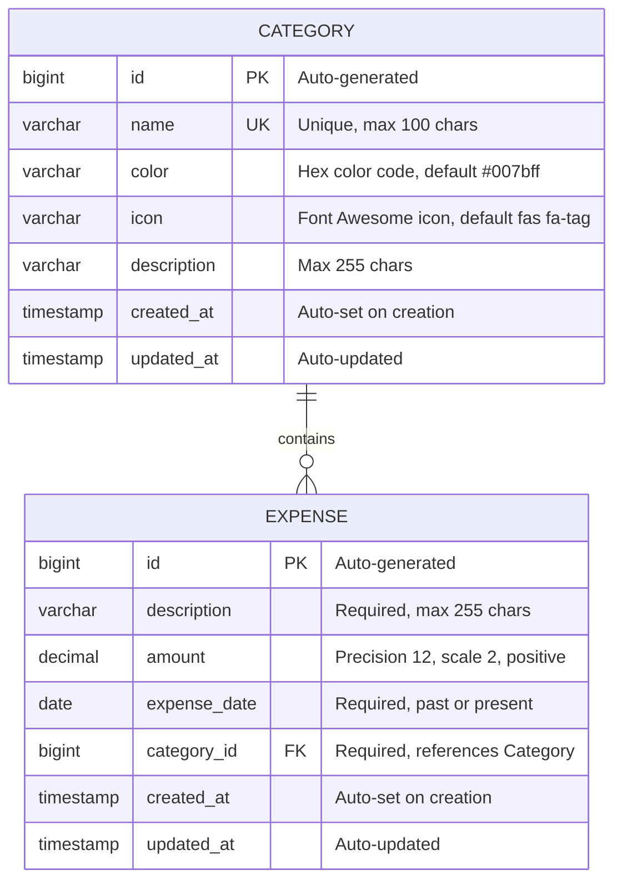
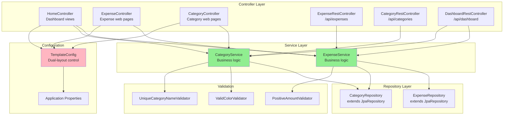
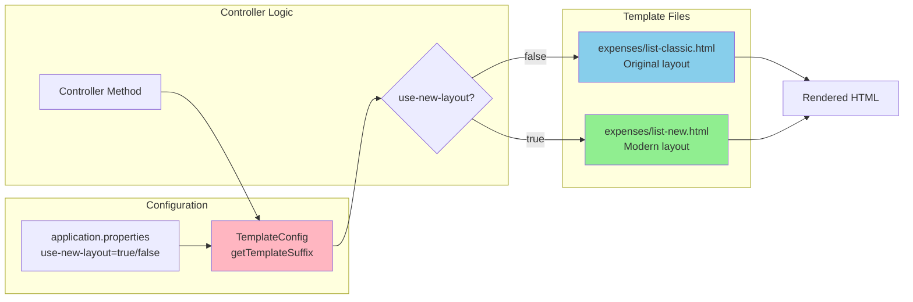
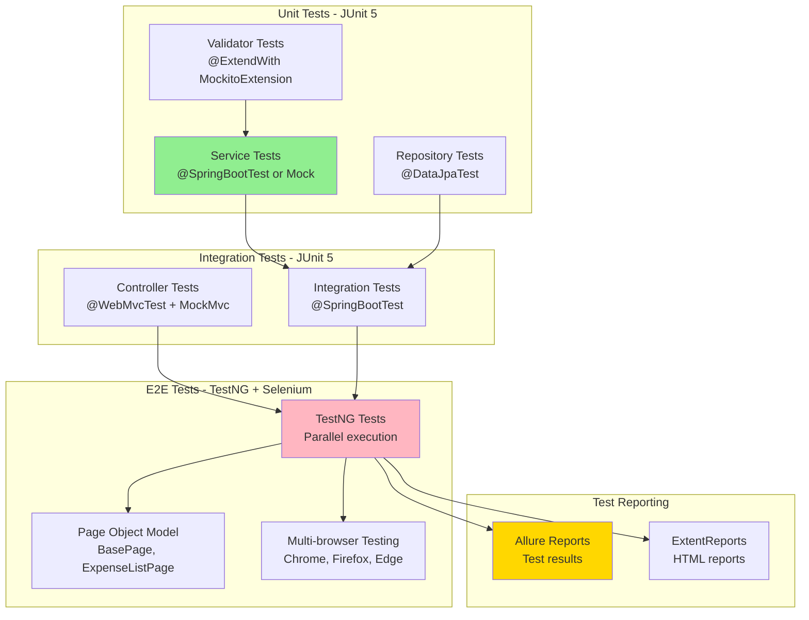
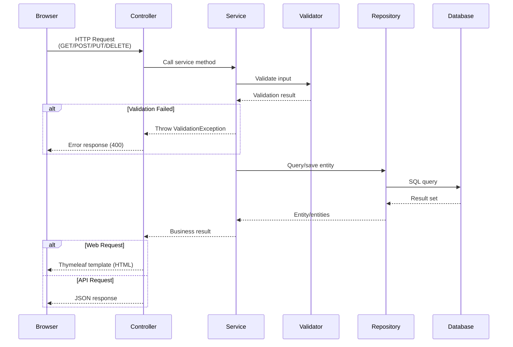
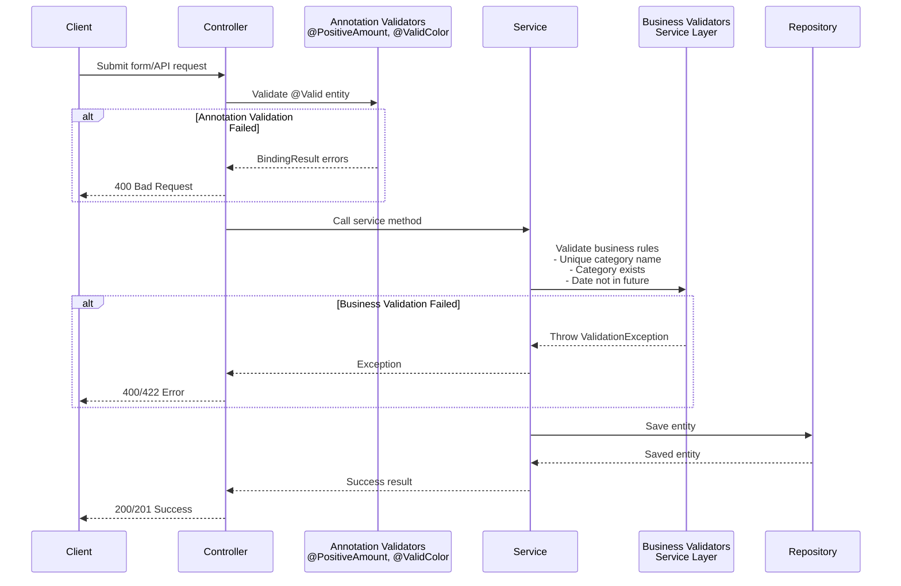
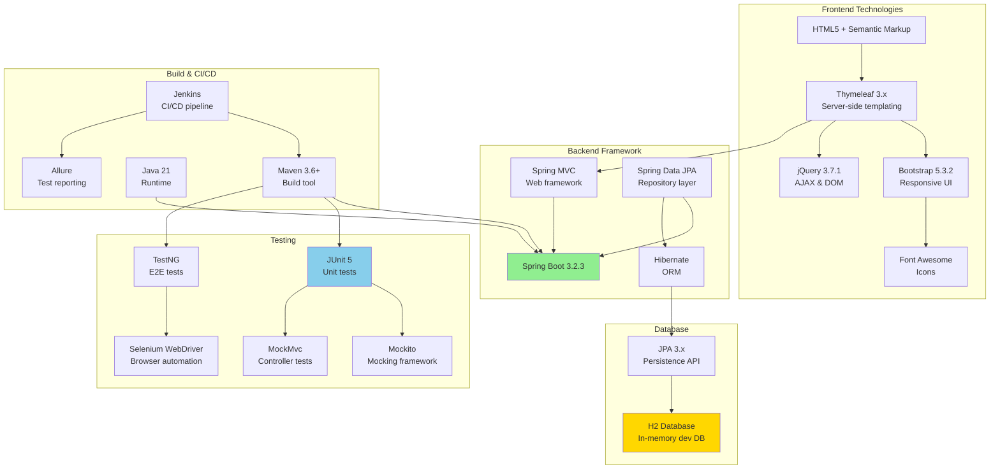
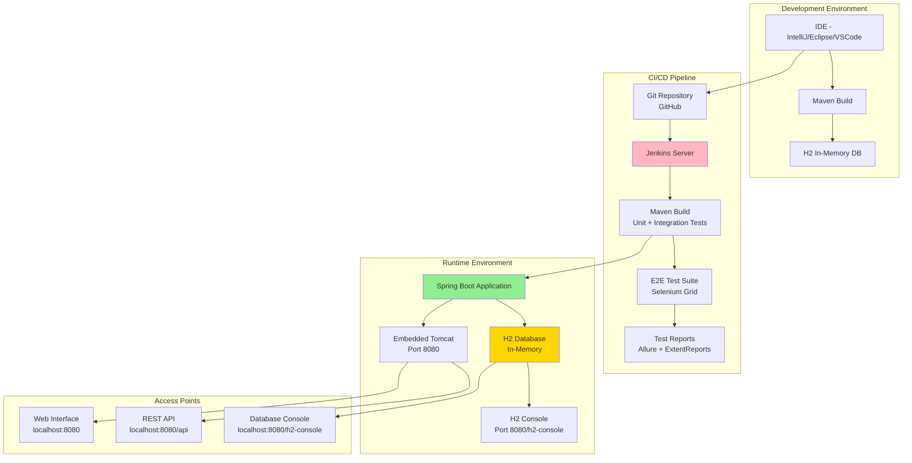

# Personal Expense Tracker - Architecture Documentation

This document provides a comprehensive overview of the Personal Expense Tracker application architecture, including system design, component relationships, data flows, and technology stack.

## Table of Contents
1. [High-Level Architecture](#high-level-architecture)
2. [Entity Relationship Diagram](#entity-relationship-diagram)
3. [Detailed Component Architecture](#detailed-component-architecture)
4. [Template Architecture (Dual-Layout System)](#template-architecture-dual-layout-system)
5. [Testing Architecture](#testing-architecture)
6. [Data Flow Diagram](#data-flow-diagram)
7. [Validation Flow](#validation-flow)
8. [Technology Stack](#technology-stack)
9. [Deployment Architecture](#deployment-architecture)
10. [Architectural Decisions](#architectural-decisions)

---

## High-Level Architecture

The application follows a classic **layered architecture** pattern with clear separation of concerns:



---

## Entity Relationship Diagram

The domain model consists of two core entities with a one-to-many relationship:



### Entity Details

**Category Entity**:
- **Purpose**: Organize expenses into logical groups (Food, Transportation, etc.)
- **Validations**: 
  - `@NotBlank` name, unique constraint
  - `@ValidColor` custom annotation for hex colors
  - `@Size` constraints on description and icon
- **Relationships**: `@OneToMany` with Expense (cascade all, orphan removal)
- **Audit**: Automatic `createdAt` and `updatedAt` timestamps

**Expense Entity**:
- **Purpose**: Represent individual expense transactions
- **Validations**: 
  - `@NotNull` amount, description, date, category
  - `@PositiveAmount` custom annotation for positive values
  - `@PastOrPresent` ensures date is not in future
  - `@DecimalMin`, `@DecimalMax`, `@Digits` for amount constraints
- **Relationships**: `@ManyToOne` with Category (lazy fetch)
- **Audit**: Automatic `createdAt` and `updatedAt` timestamps

---

## Detailed Component Architecture



### Component Responsibilities

**Controllers**:
- **Web Controllers**: Render Thymeleaf templates, handle form submissions
- **REST Controllers**: Return JSON responses, handle API requests
- **Separation**: `/expenses` (web) vs `/api/expenses` (API)

**Services**:
- Business logic and validation
- Transaction management (`@Transactional`)
- Exception handling (custom exceptions)
- Cross-entity operations

**Repositories**:
- Data access using Spring Data JPA
- Custom query methods (derived and `@Query`)
- Example: `findByExpenseDateBetween()`, `getTotalExpenses()`

**Validators**:
- Custom validation annotations
- Validator classes implementing `ConstraintValidator`
- Domain-specific validation rules

---

## Template Architecture (Dual-Layout System)

A unique feature allowing safe migration between template systems:



### Template System Features

**Configuration-Driven**:
```properties
app.template.use-new-layout=false  # Use classic templates
app.template.use-new-layout=true   # Use new layout system
```

**Controller Pattern**:
```java
return "expenses/list" + templateConfig.getTemplateSuffix();
// Returns: "expenses/list-classic" or "expenses/list-new"
```

**Benefits**:
- Zero-downtime migration capability
- Immediate rollback if issues arise
- Progressive enhancement approach
- A/B testing capabilities

**File Structure**:
```
templates/
├── categories/
│   ├── list-classic.html
│   ├── list-new.html
│   ├── form-classic.html
│   └── form-new.html
├── expenses/
│   ├── list-classic.html
│   ├── list-new.html
│   ├── form-classic.html
│   └── form-new.html
└── layout/
    └── main.html (new layout template)
```

---

## Testing Architecture

Multi-framework testing strategy for comprehensive coverage:



### Testing Strategy

**Unit Tests (JUnit 5)**:
- **Repository**: `@DataJpaTest` with `TestEntityManager`
- **Service**: Mock repositories, test business logic
- **Validator**: Test validation rules in isolation

**Integration Tests (JUnit 5)**:
- **Controller**: `@WebMvcTest` with `MockMvc`
- **Full Stack**: `@SpringBootTest` with embedded H2

**E2E Tests (TestNG + Selenium)**:
- **Page Object Model**: Separate page structure from test logic
- **Parallel Execution**: Multiple tests run concurrently
- **Multi-Browser**: Chrome, Firefox, Edge support

**Test Data Builders**:
```java
// Fluent builder pattern for test data
Expense expense = ExpenseBuilder.builder()
    .description("Test Expense")
    .amount(new BigDecimal("100.00"))
    .build();
```

---

## Data Flow Diagram

Request/response flow through the application:



### Request Flow Details

1. **Web Request**: Browser → Controller → Service → Repository → Database
2. **Validation**: Happens at multiple layers (annotation, service, controller)
3. **Transaction**: Service layer manages transactions
4. **Response**: HTML (web) or JSON (API)

---

## Validation Flow

Multi-layer validation strategy:



### Validation Layers

**Layer 1: Annotation Validation**
- `@NotNull`, `@NotBlank`, `@Size`, `@Pattern`
- Custom: `@PositiveAmount`, `@ValidColor`, `@UniqueCategoryName`

**Layer 2: Service Layer Business Rules**
- Entity relationships (Category must exist)
- Business constraints (no future dates)
- Complex validations (duplicate checks)

**Layer 3: Database Constraints**
- Unique constraints (category name)
- Foreign key constraints (category_id)
- Not null constraints

---

## Technology Stack

Complete technology overview:



### Version Details

| Component | Version | Purpose |
|-----------|---------|---------|
| Java | 21 | Primary language |
| Spring Boot | 3.2.3 | Application framework |
| Spring Data JPA | Included in Boot | Data access |
| Hibernate | Included in Boot | ORM provider |
| H2 Database | Runtime | Development database |
| Thymeleaf | 3.x | Template engine |
| Bootstrap | 5.3.2 | CSS framework |
| jQuery | 3.7.1 | JavaScript library |
| JUnit | 5.x | Unit testing |
| TestNG | Latest | E2E testing |
| Selenium | 4.x | Browser automation |
| Maven | 3.6+ | Build tool |

---

## Deployment Architecture

Application deployment and runtime environment:



### Deployment Details

**Development Setup**:
1. Clone repository
2. Run `mvn clean compile`
3. Run `mvn spring-boot:run`
4. Access at `http://localhost:8080`

**CI/CD Pipeline**:
1. Code pushed to GitHub
2. Jenkins triggers build
3. Maven compiles and runs tests
4. E2E tests execute in parallel
5. Allure reports generated
6. Artifacts archived

**Production Considerations**:
- Replace H2 with production database (PostgreSQL, MySQL)
- Configure external application properties
- Enable production profiles
- Set up proper logging and monitoring

---

## Architectural Decisions

### Why Dual-Layout Template System?

**Problem**: Need to modernize UI without disrupting existing functionality

**Solution**: Configuration-driven template switching
- Original templates preserved with `-classic` suffix
- New templates available with `-new` suffix
- Single property toggle: `app.template.use-new-layout`
- Zero-downtime migration capability

**Benefits**:
- Safe migration path
- Immediate rollback if needed
- Progressive enhancement approach
- A/B testing capabilities

### Why Dual Controller Pattern?

**Problem**: Different clients need different response formats (HTML vs JSON)

**Solution**: Separate web and REST controllers
- **Web Controllers**: Return view names, render Thymeleaf templates
- **REST Controllers**: Return JSON, handle API requests

**Benefits**:
- Clear separation of concerns
- Different error handling strategies
- Easier to maintain and test
- Supports multiple client types

### Why Multi-Framework Testing?

**Problem**: Need comprehensive testing coverage at different levels

**Solution**: JUnit 5 for unit/integration, TestNG for E2E
- **JUnit 5**: Fast unit tests, repository tests, controller tests
- **TestNG**: Parallel E2E tests, better reporting, data providers

**Benefits**:
- Each framework used for its strengths
- Comprehensive test coverage
- Parallel execution for faster feedback
- Multiple reporting options

### Why Custom Validation Annotations?

**Problem**: Domain-specific validation rules not covered by standard annotations

**Solution**: Custom validation annotations with validator classes
- `@PositiveAmount` - Financial validation
- `@ValidColor` - Hex color validation
- `@UniqueCategoryName` - Database-level uniqueness

**Benefits**:
- Reusable validation logic
- Consistent error messages
- Domain-specific rules
- Declarative validation

### Why BigDecimal for Amounts?

**Problem**: Floating-point arithmetic is imprecise for financial calculations

**Solution**: Always use `BigDecimal` for monetary amounts
- Precision: 12 digits
- Scale: 2 decimal places
- String constructor for exact values

**Benefits**:
- Accurate financial calculations
- No rounding errors
- Industry best practice
- Compliance with financial standards

---

## Security Considerations

**Input Validation**:
- Multi-layer validation (annotation + service + database)
- Custom validators for domain-specific rules
- Protection against malicious input

**Error Handling**:
- Custom exceptions with appropriate error messages
- Consistent error response structure
- No sensitive information in error responses

**Database**:
- Prepared statements via JPA (SQL injection protection)
- Unique constraints on sensitive fields
- Audit fields for tracking changes

---

## Performance Considerations

**Database**:
- Lazy loading for relationships (`FetchType.LAZY`)
- Connection pooling via HikariCP (Spring Boot default)
- In-memory H2 for fast development

**Caching**:
- Second-level cache potential (not currently enabled)
- Browser caching for static resources
- Template caching in production

**Query Optimization**:
- Custom repository queries for complex operations
- Pagination support for large result sets
- Efficient SQL generation via Hibernate

---

## Future Enhancements

**Planned Improvements**:
- [ ] Move to production database (PostgreSQL/MySQL)
- [ ] Add Spring Security for authentication/authorization
- [ ] Implement caching layer (Redis/Ehcache)
- [ ] Add API documentation (Swagger/OpenAPI)
- [ ] Implement file upload for receipts
- [ ] Add export functionality (PDF/Excel)
- [ ] Implement budget tracking and alerts
- [ ] Add multi-user support with user management

---

## Conclusion

The Personal Expense Tracker demonstrates a well-architected Spring Boot application with:

✅ **Clean Architecture**: Clear separation of concerns across layers  
✅ **Flexible Design**: Dual-layout system for safe UI migration  
✅ **Comprehensive Testing**: Multi-framework approach for all test levels  
✅ **Custom Validation**: Domain-specific validation framework  
✅ **Best Practices**: Transaction management, error handling, audit trails  
✅ **Modern Stack**: Spring Boot 3, Java 21, Bootstrap 5

The architecture supports maintainability, testability, and scalability while providing a solid foundation for future enhancements.
